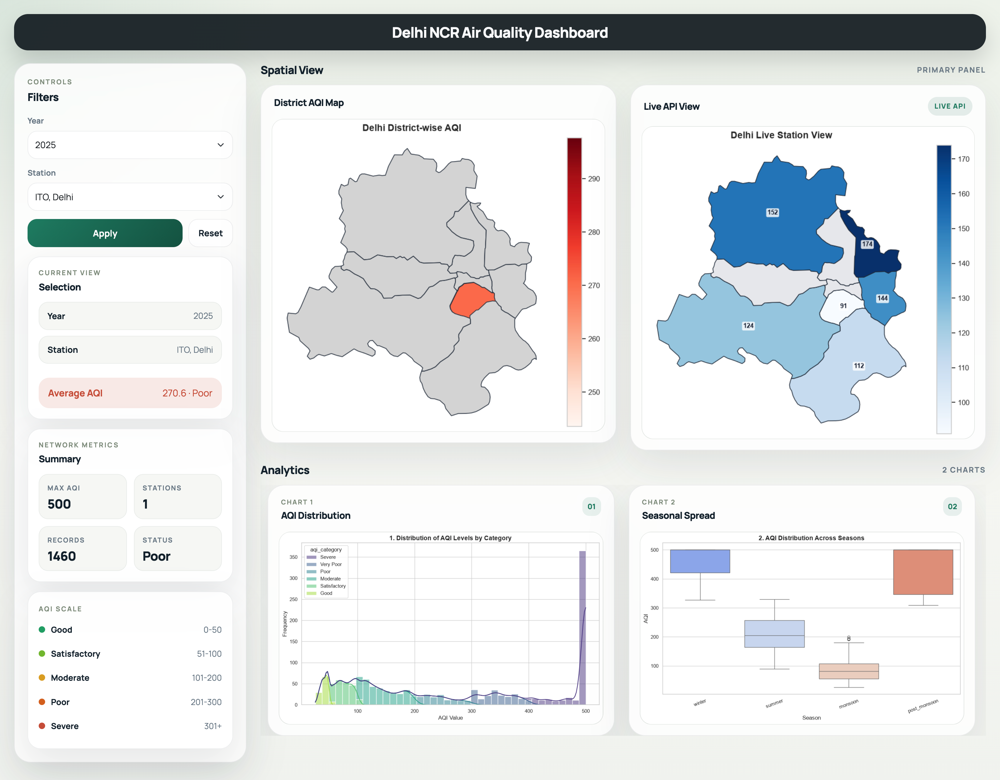

# Delhi NCR Air Quality Dashboard

A Flask web dashboard that visualizes air quality (AQI) across Delhi NCR using historical data and a live API feed.



## Overview

Air quality in Delhi is a well-known public health problem, but raw pollutant readings (PM2.5, PM10, NO2, SO2, CO, O3) are hard for a non-technical person to interpret. This project turns a ~200,000-row historical AQI dataset plus a live air-quality API into a single-page dashboard: a district-level map of pollution, a live station map, summary KPI cards, and charts showing how AQI varies by category and by season. Users can filter the whole view by year and by monitoring station.

## Features

- **District AQI map** — a choropleth of Delhi's districts (NCT of Delhi boundaries), shaded by historical average AQI, built by spatially joining monitoring-station coordinates to district polygons with GeoPandas.
- **Live API map** — a second map showing real-time AQI per district, pulled from the WAQI (World Air Quality Index) public API at request time. If the live call fails or returns no data, the view automatically falls back to the historical CSV data, and a status pill tells you which one you're looking at (`Live API` vs `Fallback CSV`).
- **KPI summary cards** — total records, average AQI (with a Good/Satisfactory/Moderate/Poor/Severe label), max AQI, and number of active stations for the current filter selection.
- **Charts** — AQI distribution by category (stacked histogram with KDE) and AQI distribution across seasons (boxplot), rendered server-side with Matplotlib/Seaborn and embedded as images.
- **Filters** — dropdowns for year and monitoring station, applied via query parameters (`/?year=2023&station=...`), with a one-click reset.
- **AQI reference scale** — a sidebar legend explaining the Good → Severe AQI bands used throughout the dashboard.

## Tech Stack

- **Backend:** Python, Flask
- **Data processing:** Pandas
- **Geospatial analysis:** GeoPandas, Shapely
- **Visualization:** Matplotlib, Seaborn (rendered to PNG, embedded as base64 images)
- **Frontend:** Jinja2 templates, Bootstrap 5 (via CDN)
- **Live data:** WAQI public REST API (accessed with Python's built-in `urllib`)

## Data Source

- **Live data:** [WAQI (World Air Quality Index) API](https://aqicn.org/api/) — the app queries `https://api.waqi.info/search/?token=...&keyword=Delhi` to get real-time AQI readings and coordinates for Delhi-area monitoring stations. A free personal token can be requested at [aqicn.org/data-platform/token](https://aqicn.org/data-platform/token/); without one, the app uses WAQI's public `demo` token (rate-limited, for testing only).
- **Historical data:** `delhi_ncr_aqi_dataset.csv` — a local dataset (~200k rows) of hourly pollutant readings (PM2.5, PM10, NO2, SO2, CO, O3), weather variables (temperature, humidity, wind speed, visibility), and computed AQI/AQI category per station. This powers the charts, KPIs, and the historical district map.
- **Geographic boundaries:** District-level shapefiles for India (Census 2011) from the open-source [Datameet maps](https://github.com/datameet/maps) project, used to draw Delhi's district polygons for the choropleth map.

## How to Run

1. **Clone the repository and move into it**
   ```bash
   git clone <your-repo-url>
   cd "Delhi AQI"
   ```

2. **Create and activate a virtual environment**
   ```bash
   python3 -m venv venv
   source venv/bin/activate      # Windows: venv\Scripts\activate
   ```

3. **Install dependencies**
   ```bash
   pip install -r requirements.txt
   ```

4. **(Optional) Set your WAQI API token**
   ```bash
   export WAQI_TOKEN=your_token_here     # Windows: set WAQI_TOKEN=your_token_here
   ```
   If skipped, the app runs on WAQI's public demo token and falls back to the historical CSV data whenever the live call doesn't return results.

5. **Run the app**
   ```bash
   python app.py
   ```

6. **Open it in your browser**
   ```
   http://localhost:5001
   ```

## What I Learned

- Combining a live third-party API with a local dataset means the API can fail, rate-limit, or return nothing — building an explicit fallback path (and showing the user which data source is live) turned out to matter more than the happy-path code itself.
- Doing spatial joins (matching station coordinates to district polygons) with GeoPandas is a different skill from plotting a chart — projections (`EPSG:4326` vs `EPSG:3857`) have to match before a `sjoin` gives sensible results.
- Rendering Matplotlib/Seaborn charts server-side to base64 images is a simple way to embed dynamic plots in HTML without a JavaScript charting library, though it means every page load re-renders every chart from scratch.
